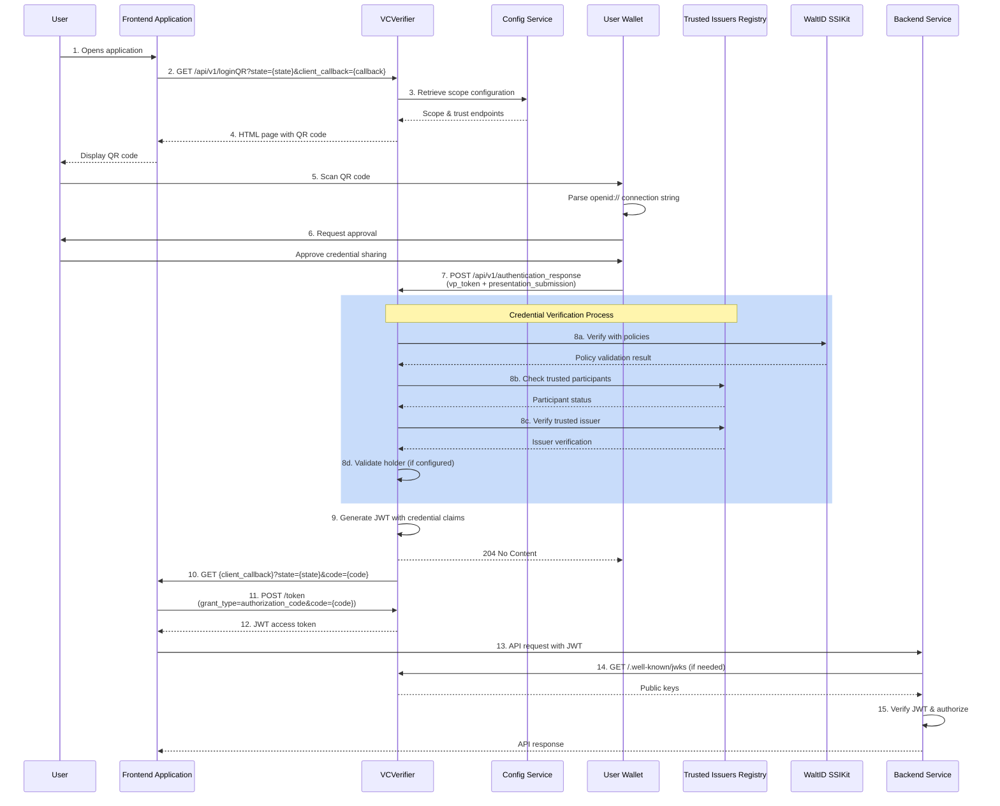
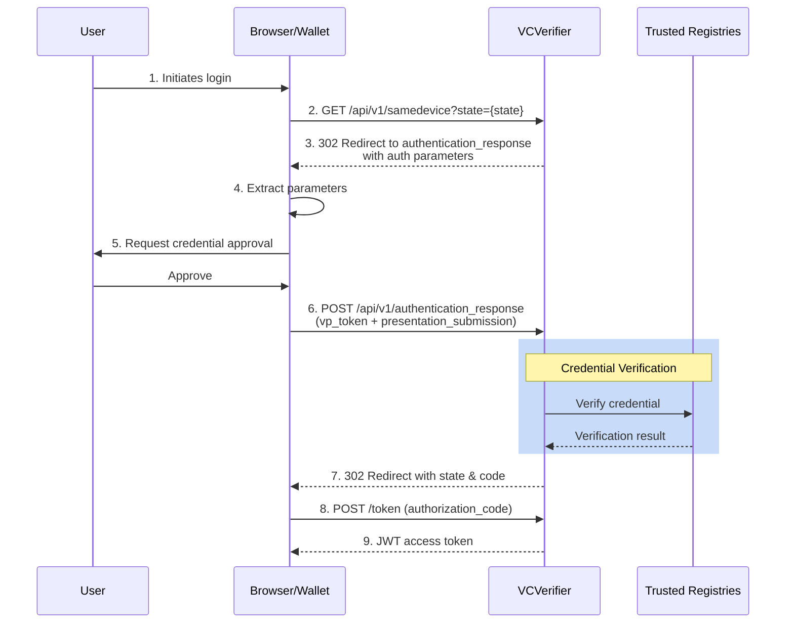
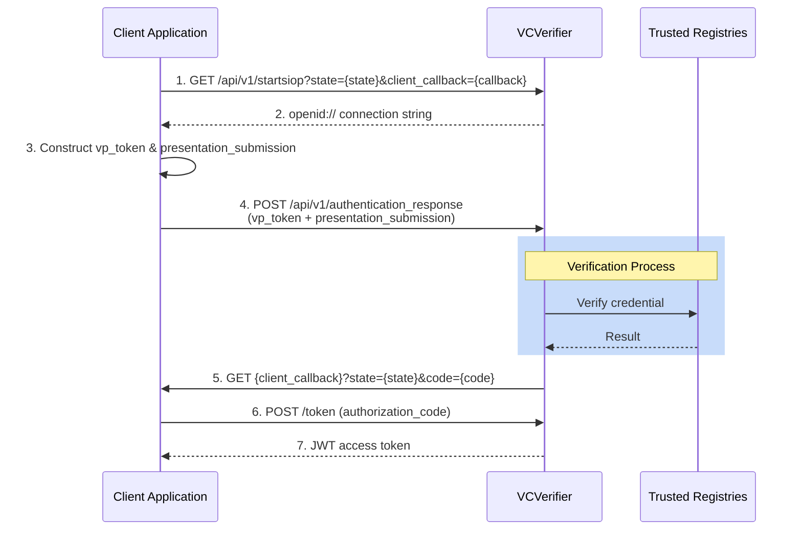
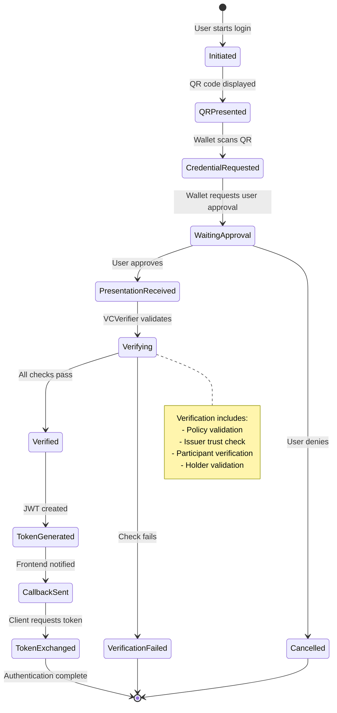
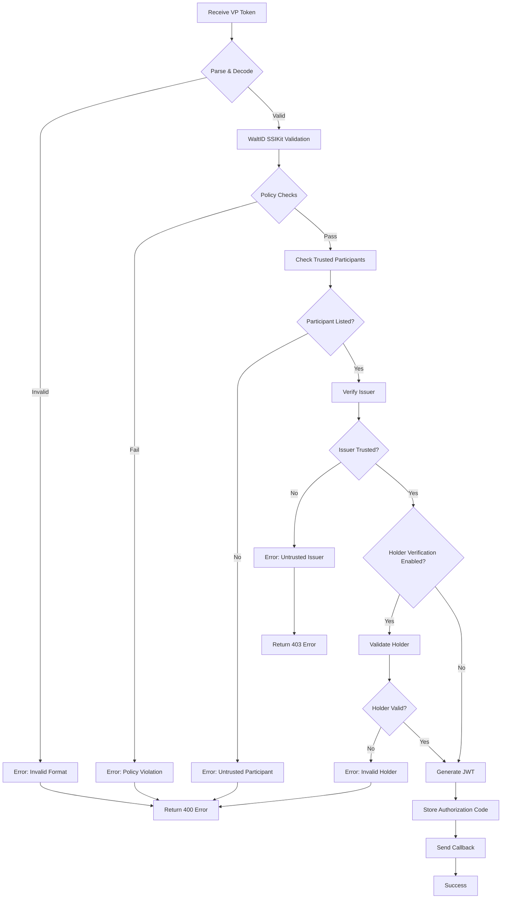
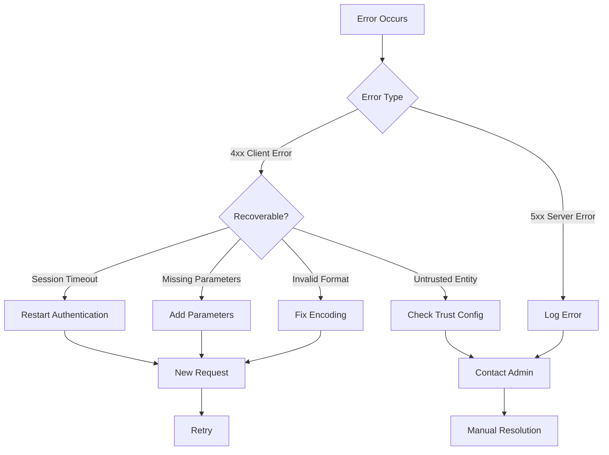
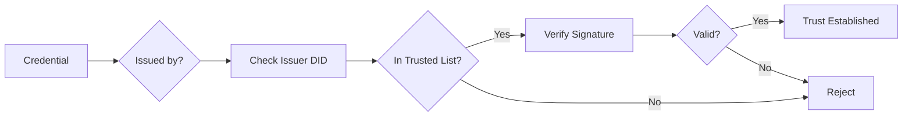

## Overview

VCVerifier implements SIOP-2 (Self-Issued OpenID Provider v2) and OIDC4VP (OpenID Connect for Verifiable Presentations) authentication flows. This page provides a detailed explanation of the complete authentication process, including different flow types, states, and error handling.

<Note>
VCVerifier acts as a **Relying Party (RP)** or **Verifier** in these flows, requesting and verifying credentials from user wallets.
</Note>

## Flow Types

VCVerifier supports three primary authentication flow types:

<CardGroup cols={3}>
  <Card title="Cross-Device Flow" icon="mobile">
    User scans QR code with mobile wallet (most common)
  </Card>
  <Card title="Same-Device Flow" icon="desktop">
    Credential held on the same device as the browser
  </Card>
  <Card title="API Flow" icon="code">
    Programmatic M2M authentication
  </Card>
</CardGroup>

## Complete Authentication Sequence

### Cross-Device Flow (QR Code)

This is the most common flow for human-to-machine interactions.



### Same-Device Flow

Used when the credential is held on the same device as the browser.



### API Flow (M2M)

Programmatic flow for machine-to-machine integrations.



## Request Modes

VCVerifier supports three modes for encoding authorization requests:

### Mode Comparison

| Mode | QR Size | Security | Wallet Support | Recommended |
|------|---------|----------|----------------|-------------|
| **urlEncoded** | Small | Basic | High | Development |
| **byValue** | Large | High | Medium | Limited use |
| **byReference** | Small | High | High | **Production** |

### URL Encoded Mode

All parameters are directly included in the openid:// URL:

```
openid4vp://?response_type=vp_token
  &response_mode=direct_post
  &client_id=did:key:z6MkigCEnopwujz8Ten2dzq91nvMjqbKQYcifuZhqBsEkH7g
  &redirect_uri=https://verifier.org/api/v1/authentication_response
  &state=randomState123
  &nonce=randomNonce456
  &scope=VerifiableCredential
```

**Use Cases:**
- Quick testing and development
- Simple credential requests
- Wallets with limited JWT support

<Warning>
Not recommended for production due to URL length limitations and lack of request signing.
</Warning>

### By Value Mode

Parameters are encoded in a signed JWT passed as the `request` parameter:

```
openid4vp://?client_id=did:key:verifier&request=eyJhbGciOiJFUzI1NiIsInR5cCI6Im9hdXRoLWF1dGh6LXJlcStqd3QifQ.eyJjbGllbnRfaWQiOiJkaWQ6a2V5OnZlcmlmaWVyIiwiZXhwIjozMCwiaXNzIjoiZGlkOmtleTp2ZXJpZmllciIsIm5vbmNlIjoicmFuZG9tTm9uY2UiLCJwcmVzZW50YXRpb25fZGVmaW5pdGlvbiI6eyJpZCI6IiIsImlucHV0X2Rlc2NyaXB0b3JzIjpudWxsLCJmb3JtYXQiOm51bGx9LCJyZWRpcmVjdF91cmkiOiJodHRwczovL3ZlcmlmaWVyLm9yZy9hcGkvdjEvYXV0aGVudGljYXRpb25fcmVzcG9uc2UiLCJyZXNwb25zZV90eXBlIjoidnBfdG9rZW4iLCJzY29wZSI6Im9wZW5pZCIsInN0YXRlIjoicmFuZG9tU3RhdGUifQ.signature
```

**Decoded JWT Header:**
```json
{
  "alg": "ES256",
  "typ": "oauth-authz-req+jwt"
}
```

**Decoded JWT Payload:**
```json
{
  "client_id": "did:key:verifier",
  "exp": 30,
  "iss": "did:key:verifier",
  "nonce": "randomNonce",
  "presentation_definition": {
    "id": "presentation-id",
    "input_descriptors": [...]
  },
  "redirect_uri": "https://verifier.org/api/v1/authentication_response",
  "response_type": "vp_token",
  "scope": "openid",
  "state": "randomState"
}
```

**Requirements:**
- `clientIdentification` must be configured with signing keys
- Supported algorithms: ES256, RS256
- JWT must be signed with verifier's private key

**Use Cases:**
- High security requirements
- Complex presentation definitions
- When request integrity is critical

<Note>
Requires proper `clientIdentification` configuration including `keyPath`, `requestKeyAlgorithm`, and optionally `certificatePath`.
</Note>

### By Reference Mode (Recommended)

A reference URI points to where the request object can be retrieved:

```
openid4vp://?client_id=did:key:verifier&request_uri=https://verifier.org/api/v1/request/274e7465-cc9d-4cad-b75f-190db927e56a&request_uri_method=get
```

The wallet then retrieves the signed request object:

```bash
GET https://verifier.org/api/v1/request/274e7465-cc9d-4cad-b75f-190db927e56a

Response: eyJhbGciOiJFUzI1NiIsInR5cCI6Im9hdXRoLWF1dGh6LXJlcStqd3QifQ...
```

**Advantages:**
- ✅ Small QR codes (better scanability)
- ✅ No URL length limitations
- ✅ Request signing support
- ✅ Dynamic request generation
- ✅ Better privacy (request not in URL)

**Use Cases:**
- Production deployments
- Complex presentation definitions
- High security environments

<Note>
**Best Practice:** Use `byReference` mode for production deployments to ensure small QR codes and maintain request integrity through signing.
</Note>

## Authentication States

The authentication flow progresses through several states:



### State Descriptions

<ResponseField name="Initiated" type="Initial State">
  User navigates to login page; session state is created
</ResponseField>

<ResponseField name="QRPresented" type="Active State">
  QR code is displayed containing openid:// connection string
  
  **Timeout:** 30 seconds (default)
</ResponseField>

<ResponseField name="CredentialRequested" type="Active State">
  Wallet has scanned QR and parsed authorization request
</ResponseField>

<ResponseField name="WaitingApproval" type="Active State">
  Wallet is waiting for user to approve or deny credential sharing
</ResponseField>

<ResponseField name="PresentationReceived" type="Processing State">
  VCVerifier has received vp_token and presentation_submission
</ResponseField>

<ResponseField name="Verifying" type="Processing State">
  Multi-step verification process is in progress:
  1. WaltID SSIKit policy validation
  2. Trusted participants list check
  3. Trusted issuer verification
  4. Holder validation (if enabled)
</ResponseField>

<ResponseField name="Verified" type="Success State">
  All verification checks passed; credential is trusted
</ResponseField>

<ResponseField name="VerificationFailed" type="Error State">
  One or more verification checks failed
  
  **Common causes:** Untrusted issuer, expired credential, invalid signature
</ResponseField>

<ResponseField name="TokenGenerated" type="Success State">
  JWT access token has been created with credential claims
</ResponseField>

<ResponseField name="CallbackSent" type="Success State">
  Frontend application has been notified via callback URL
</ResponseField>

<ResponseField name="TokenExchanged" type="Final State">
  Client has exchanged authorization code for JWT token
</ResponseField>

## Verification Process

When VCVerifier receives a credential presentation, it performs multiple verification steps:

### Verification Steps



### 1. Format Validation

**Checks:**
- VP token is valid Base64URL-encoded string
- Presentation submission is valid JSON
- Required fields are present

**Validation Modes:**

<ResponseField name="none" type="No validation">
  Accepts all credentials (not recommended for production)
</ResponseField>

<ResponseField name="jsonLd" type="JSON-LD validation">
  Uses JSON-LD parser for structural validation
</ResponseField>

<ResponseField name="baseContext" type="Base context validation">
  Validates only specified fields and values; no extra fields allowed
</ResponseField>

<ResponseField name="combined" type="JSON-LD + Schema">
  Full validation with both JSON-LD and schema checks (recommended)
</ResponseField>

### 2. WaltID SSIKit Policy Validation

**Policies Checked:**
- Signature validity
- Credential expiration
- Credential status (revocation)
- Schema compliance
- Issuer DID resolution

### 3. Trusted Participants Verification

VCVerifier supports multiple types of participant registries:

<CardGroup cols={2}>
  <Card title="EBSI TIR" icon="building">
    EBSI Trusted Issuers Registry for EU compliance
  </Card>
  <Card title="Gaia-X Registry" icon="globe">
    Gaia-X Digital Clearing House registry
  </Card>
</CardGroup>

**Verification Process:**

```
FOR each credential type in presentation:
  FOR each configured participant list:
    Query list for holder DID
    IF found:
      Mark as trusted
      CONTINUE to issuer check
IF no list contains holder:
  REJECT with "Untrusted Participant"
```

### 4. Trusted Issuer Verification

**Steps:**
1. Extract issuer DID from credential
2. Query configured Trusted Issuers Lists
3. Verify issuer is authorized for credential type
4. Check issuer's allowed claims (if configured)

**Configuration Example:**

```yaml
trustedIssuersLists:
  VerifiableCredential:
    - type: ebsi
      url: https://tir-pdc.ebsi.fiware.dev
  CustomerCredential:
    - type: ebsi
      url: https://tir-pdc.ebsi.fiware.dev
    - type: gaia-x
      url: https://registry.lab.gaia-x.eu
```

<Note>
If multiple lists are configured, the issuer is considered trusted if found in **any** of the lists.
</Note>

### 5. Holder Verification (Optional)

When `holderVerification.enabled` is `true`:

**Checks:**
- Holder claim exists in credential
- Holder DID matches presentation proof
- Holder's signature is valid

**Configuration:**

```yaml
holderVerification:
  enabled: true
  claim: subject  # Claim to extract holder from
```

## Error Handling

### Error Scenarios

<ResponseField name="Session Timeout" type="400 Bad Request">
  **Cause:** Authentication session expired (default: 30 seconds)
  
  **Response:**
  ```json
  {
    "summary": "Session Expired",
    "details": "The authentication session has timed out. Please restart the login process."
  }
  ```
  
  **Solution:** Initiate a new authentication flow
</ResponseField>

<ResponseField name="Missing Parameters" type="400 Bad Request">
  **Cause:** Required query parameter not provided
  
  **Response:**
  ```json
  {
    "summary": "Missing Input",
    "details": "Expected 'state' as a query parameter."
  }
  ```
  
  **Solution:** Include all required parameters in the request
</ResponseField>

<ResponseField name="Invalid Credential Format" type="400 Bad Request">
  **Cause:** VP token or presentation submission is malformed
  
  **Response:**
  ```json
  {
    "summary": "Invalid Format",
    "details": "The vp_token is not a valid Base64URL-encoded string."
  }
  ```
  
  **Solution:** Ensure proper Base64URL encoding (RFC 4648 Section 5)
</ResponseField>

<ResponseField name="Policy Violation" type="400 Bad Request">
  **Cause:** Credential failed WaltID SSIKit policy checks
  
  **Common Issues:**
  - Expired credential
  - Invalid signature
  - Revoked credential
  - Schema mismatch
  
  **Solution:** Ensure credential is valid and not expired
</ResponseField>

<ResponseField name="Untrusted Issuer" type="403 Forbidden">
  **Cause:** Issuer not found in any configured Trusted Issuers List
  
  **Response:**
  ```json
  {
    "summary": "Untrusted Issuer",
    "details": "The credential issuer is not in the trusted issuers registry."
  }
  ```
  
  **Solution:** Ensure issuer is registered in the appropriate trust registry
</ResponseField>

<ResponseField name="Untrusted Participant" type="403 Forbidden">
  **Cause:** Holder not found in configured Trusted Participants Lists
  
  **Solution:** Register participant in the appropriate trust registry
</ResponseField>

<ResponseField name="Invalid Holder" type="400 Bad Request">
  **Cause:** Holder verification failed (when enabled)
  
  **Common Issues:**
  - Holder DID doesn't match proof
  - Holder claim missing from credential
  - Invalid holder signature
  
  **Solution:** Ensure holder DID matches and signature is valid
</ResponseField>

<ResponseField name="Invalid Authorization Code" type="403 Forbidden">
  **Cause:** Code is invalid, expired, or already used
  
  **Response:**
  ```json
  {
    "summary": "Invalid Code",
    "details": "The provided authorization code is invalid or has expired."
  }
  ```
  
  **Solution:** Complete the authentication flow again to get a new code
</ResponseField>

### Error Recovery Flow



## Security Considerations

<Warning>
**Important Security Considerations:**

1. **Session Expiry:** Default 30 seconds. Configure via `verifier.sessionExpiry`
2. **Nonce Validation:** Each request must include a unique nonce for replay protection
3. **State Management:** State parameter must be securely generated and validated
4. **HTTPS Required:** All production deployments must use HTTPS
5. **Trust Anchor Configuration:** Carefully configure trusted issuers and participants lists
6. **JWT Verification:** Downstream services must verify JWT signatures using JWKS endpoint
</Warning>

### Replay Attack Prevention

1. **Nonce:** Each authorization request includes a unique nonce
2. **State:** Session-specific state prevents CSRF attacks
3. **Code Expiry:** Authorization codes are single-use and expire quickly
4. **Session Timeout:** Authentication sessions expire after 30 seconds

### Trust Establishment



## JWT Token Structure

After successful verification, VCVerifier issues a JWT access token:

### JWT Header

```json
{
  "alg": "ES256",  // or RS256
  "kid": "WOHFu4HZ59SM853C7eN0OvlKGrMeerDCpHOURoTQwHw",
  "typ": "JWT"
}
```

### JWT Payload

The JWT contains the verified credential as claims:

```json
{
  "iss": "https://verifier.example.com",
  "sub": "did:key:z6Mks9m9ifLwy3JWqH4c57EbBQVS2SpRCjfa79wHb5vWM6vh",
  "aud": "https://backend.example.com",
  "exp": 1679500800,
  "iat": 1679497200,
  "nbf": 1679497200,
  "verifiablePresentation": {
    "@context": ["https://www.w3.org/2018/credentials/v1"],
    "type": ["VerifiablePresentation"],
    "verifiableCredential": [
      {
        "@context": [
          "https://www.w3.org/2018/credentials/v1",
          "https://w3id.org/security/suites/jws-2020/v1"
        ],
        "types": ["PacketDeliveryService", "VerifiableCredential"],
        "credentialSubject": {
          "id": "did:key:z6Mks9m9...",
          "name": "John Doe",
          "serviceLevel": "premium"
        },
        "issuer": "did:key:z6MkigCEnopwujz...",
        "issuanceDate": "2024-01-15T10:30:00Z",
        "expirationDate": "2025-01-15T10:30:00Z"
      }
    ]
  }
}
```

<Note>
**Important:** Currently, only the **first credential** in multi-credential presentations is included in the JWT.
</Note>

## Integration Examples

### Frontend Integration

```javascript
// 1. Initiate login flow
const state = generateUUID();
const callbackUrl = encodeURIComponent('https://myapp.com/auth/callback');
window.location.href = `https://verifier.example.com/api/v1/loginQR?state=${state}&client_callback=${callbackUrl}`;

// 2. Handle callback
app.get('/auth/callback', async (req, res) => {
  const { state, code } = req.query;
  
  // Verify state matches session
  if (state !== session.state) {
    return res.status(403).send('Invalid state');
  }
  
  // Exchange code for token
  const response = await fetch('https://verifier.example.com/token', {
    method: 'POST',
    headers: { 'Content-Type': 'application/x-www-form-urlencoded' },
    body: new URLSearchParams({
      grant_type: 'authorization_code',
      code: code,
      redirect_uri: 'https://myapp.com/auth/callback'
    })
  });
  
  const { access_token } = await response.json();
  
  // Store token and continue
  session.accessToken = access_token;
  res.redirect('/dashboard');
});
```

### Backend JWT Verification

```javascript
const jose = require('jose');

// Fetch JWKS (cache this in production)
const JWKS = jose.createRemoteJWKSet(
  new URL('https://verifier.example.com/.well-known/jwks')
);

// Verify incoming JWT
async function verifyToken(token) {
  try {
    const { payload } = await jose.jwtVerify(token, JWKS, {
      issuer: 'https://verifier.example.com',
      audience: 'https://backend.example.com'
    });
    
    // Extract credential claims
    const credential = payload.verifiablePresentation.verifiableCredential[0];
    const subject = credential.credentialSubject;
    
    return {
      valid: true,
      userId: subject.id,
      claims: subject
    };
  } catch (error) {
    return { valid: false, error: error.message };
  }
}
```

### API Flow (M2M)

```bash
# 1. Start SIOP flow
curl -X GET "https://verifier.example.com/api/v1/startsiop?state=randomState123&client_callback=https://myapp.com/callback"

# Response: openid://?scope=...

# 2. Present credential
curl -X POST "https://verifier.example.com/api/v1/authentication_response?state=randomState123" \
  -H "Content-Type: application/x-www-form-urlencoded" \
  -d "vp_token=eyJAY29udGV4dCI6..." \
  -d "presentation_submission=eyJpZCI6..."

# 3. Receive callback
# GET https://myapp.com/callback?state=randomState123&code=authCode456

# 4. Exchange for token
curl -X POST "https://verifier.example.com/token" \
  -H "Content-Type: application/x-www-form-urlencoded" \
  -d "grant_type=authorization_code" \
  -d "code=authCode456" \
  -d "redirect_uri=https://myapp.com/callback"

# Response:
# {
#   "token_type": "Bearer",
#   "expires_in": 3600,
#   "access_token": "eyJhbGciOiJFUzI1NiI..."
# }
```

## Best Practices

<CardGroup cols={2}>
  <Card title="Use byReference Mode" icon="link">
    Generates smaller QR codes and supports request signing
  </Card>
  <Card title="Configure Session Timeout" icon="clock">
    Adjust sessionExpiry based on your use case (default: 30s)
  </Card>
  <Card title="Verify JWT on Backend" icon="shield-check">
    Always verify JWT signatures using the JWKS endpoint
  </Card>
  <Card title="Monitor Trust Registries" icon="list-check">
    Regularly update trusted issuers and participants lists
  </Card>
  <Card title="Use HTTPS Only" icon="lock">
    Never use HTTP in production environments
  </Card>
  <Card title="Implement Rate Limiting" icon="gauge">
    Protect endpoints at the API gateway level
  </Card>
</CardGroup>

## Known Limitations

<Warning>
Be aware of these current limitations:

1. **No Identity Proof:** VCVerifier does not offer endpoints to prove its own identity
2. **Presentation Submissions:** Accepted but not fully evaluated
3. **Multi-Credential JWTs:** Only the first credential is included in the JWT token
4. **No Built-in Rate Limiting:** Must be implemented at proxy/gateway level
</Warning>

## Next Steps

<CardGroup cols={2}>
  <Card title="API Overview" icon="book" href="/api/overview">
    Complete API endpoint reference
  </Card>
  <Card title="Configuration Guide" icon="gear" href="/configuration">
    Learn how to configure VCVerifier
  </Card>
  <Card title="Trust Anchors" icon="shield" href="/trust-anchors">
    Configure trusted issuers and participants
  </Card>
  <Card title="Deployment" icon="server" href="/deployment">
    Deploy VCVerifier to production
  </Card>
</CardGroup>