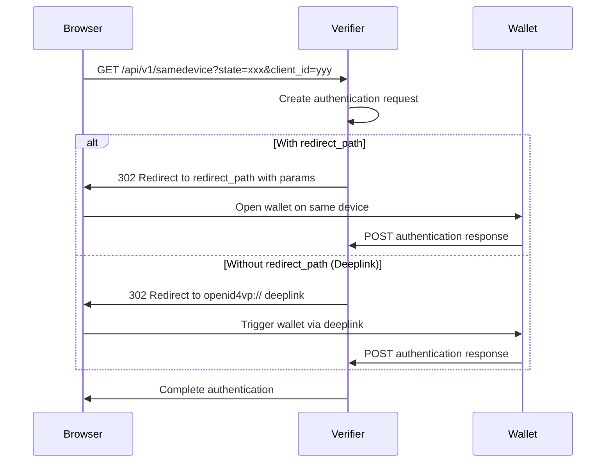

## Overview

The same-device endpoint initiates the SIOP (Self-Issued OpenID Provider) flow when the verifiable credential is already present in the requesting browser or device. This flow is optimized for scenarios where the user's wallet is on the same device as the browser.

<Note>
  This endpoint creates the login information and redirects to the authentication response path or returns an OID4VP deeplink, depending on whether a `redirect_path` is provided.
</Note>

## Endpoint

```
GET /api/v1/samedevice
```

## Query Parameters

<ParamField query="state" type="string" required>
  Session state identifier used to maintain state between the request and callback.
  
  **Example:** `274e7465-cc9d-4cad-b75f-190db927e56a`
</ParamField>

<ParamField query="client_id" type="string">
  The identifier of the client/service that intends to start the authentication flow. Used to retrieve the scope and trust services for verification.
  
  **Example:** `packet-delivery-portal`
</ParamField>

<ParamField query="scope" type="string">
  The scope of the access request. Defines what credentials or permissions are being requested.
  
  **Example:** `openid`
</ParamField>

<ParamField query="request_mode" type="string" default="byReference">
  Mode to be used for the authorization request.
  
  **Enum:** `urlEncoded` | `byValue` | `byReference`
  
  **Default:** `byReference`
</ParamField>

<ParamField query="redirect_path" type="string">
  If no redirect path is provided, an 'oid4vp' deeplink will be returned. When provided, the endpoint redirects to this path after creating the authentication request.
  
  **Example:** `/`
</ParamField>

## Response

### 302 - Redirect

A redirect to the authentication response path or deeplink, containing the authorization parameters.

<ResponseField name="Location" type="string">
  The redirect URL containing authorization parameters:
  - `scope`: Requested credential scope
  - `response_type`: Type of response expected (typically `vp_token`)
  - `client_id`: DID of the verifier
  - `redirect_uri`: URI to receive the authentication response
  - `state`: Session state identifier
  - `nonce`: Unique value for replay attack prevention
</ResponseField>

**Redirect Types:**

1. **With redirect_path**: Redirects to `{redirect_path}` with authorization parameters
2. **Without redirect_path**: Returns an OID4VP deeplink in the format:
   ```
   openid4vp://?client_id=did:key:z6Mkt...&request_uri=https://...
   ```

### 400 - Bad Request

Returned when required parameters are missing.

<ResponseField name="summary" type="string">
  Error summary message.
</ResponseField>

<ResponseField name="details" type="string">
  Detailed error description.
</ResponseField>

### 500 - Internal Server Error

Returned when the same-device flow cannot be initiated.

<ResponseField name="summary" type="string">
  Error summary describing the failure.
</ResponseField>

<ResponseField name="details" type="string">
  Detailed error information.
</ResponseField>

## Examples

<CodeGroup>

```bash Basic Same-Device Flow
curl -X GET "https://verifier.example.com/api/v1/samedevice?state=274e7465-cc9d-4cad-b75f-190db927e56a&client_id=packet-delivery-portal&scope=openid" \
  -L
```

```bash With Redirect Path
curl -X GET "https://verifier.example.com/api/v1/samedevice?state=274e7465-cc9d-4cad-b75f-190db927e56a&client_id=packet-delivery-portal&scope=openid&redirect_path=/callback" \
  -L
```

```bash With Custom Request Mode
curl -X GET "https://verifier.example.com/api/v1/samedevice?state=274e7465-cc9d-4cad-b75f-190db927e56a&client_id=packet-delivery-portal&scope=openid&request_mode=urlEncoded" \
  -L
```

```bash Deeplink Flow (No Redirect Path)
curl -X GET "https://verifier.example.com/api/v1/samedevice?state=274e7465-cc9d-4cad-b75f-190db927e56a&client_id=packet-delivery-portal&scope=dsba.credentials.presentation.PacketDeliveryService" \
  -L
```

</CodeGroup>

## Common Errors

<Warning>
  **Missing State**: The `state` parameter is mandatory. Requests without a state will be rejected with a 400 error.
</Warning>

| Error Code | Summary | Details |
|------------|---------|----------|
| 400 | `no_state_provided` | Authentication requires a state provided as query parameter. |
| 500 | `failed_same_device` | Was not able to start a same-device flow. |

## Flow Diagram



## Implementation Notes

### Protocol Detection

The endpoint automatically detects whether the request is made over HTTP or HTTPS by checking the TLS connection:
- If TLS is present: Uses `https://` protocol
- If TLS is absent: Uses `http://` protocol

### Request Protocols

1. **REDIRECT_PROTOCOL**: Used when `redirect_path` is provided
   - Redirects to the specified path with authorization parameters
   - Suitable for web-based wallet integrations

2. **OPENID4VP_PROTOCOL**: Used when no `redirect_path` is provided
   - Returns an OpenID4VP deeplink
   - Suitable for mobile wallet applications

### Default Behavior

- If `client_id` is not provided, the flow starts for an unspecified client
- If `scope` is not provided, the default scope for the client is used
- If `request_mode` is not provided, defaults to `byReference`

### Security Considerations

- The `state` parameter must be unique and unpredictable to prevent CSRF attacks
- The same-device flow assumes the user's wallet is accessible on the same device
- All authentication responses are validated before issuing tokens

## Use Cases

### Mobile Web Browser with Mobile Wallet

When a user accesses a web application on their mobile device and has a wallet app installed:

```bash
curl -X GET "https://verifier.example.com/api/v1/samedevice?state=unique-state-123&client_id=my-app&scope=VerifiableCredential"
```

This returns a deeplink that opens the wallet app on the same device.

### Progressive Web App (PWA)

For PWAs with integrated wallet functionality:

```bash
curl -X GET "https://verifier.example.com/api/v1/samedevice?state=unique-state-456&client_id=pwa-app&scope=VerifiableCredential&redirect_path=/auth/response"
```

This redirects to the specified path with authorization parameters.
