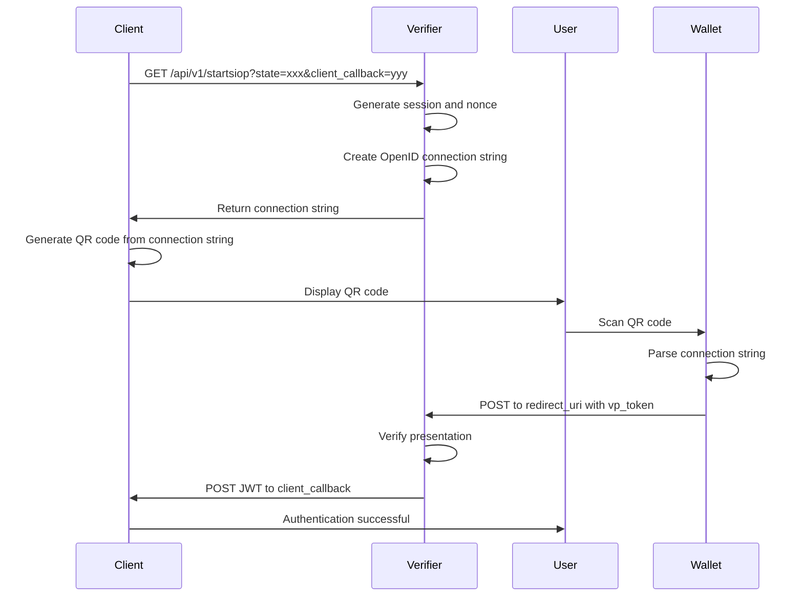

## Overview

The Start SIOP endpoint initiates the SIOP (Self-Issued OpenID Provider) flow and returns an OpenID connection string that can be encoded in a QR code or sent to a wallet application. This endpoint is typically used for cross-device authentication flows.

<Note>
  This endpoint is part of the API tag and can be reused by other applications to integrate credential verification into their authentication flows.
</Note>

## Endpoint

```
GET /api/v1/startsiop
```

## Query Parameters

<ParamField query="state" type="string" required>
  Session state identifier used to maintain state between the request and callback. This value must be unique for each authentication session.
  
  **Example:** `274e7465-cc9d-4cad-b75f-190db927e56a`
</ParamField>

<ParamField query="client_callback" type="string" required>
  Endpoint of the client application to receive the JWT token after successful authentication.
  
  **Format:** URL
  
  **Example:** `https://my-portal.com/auth_callback`
</ParamField>

<ParamField query="client_id" type="string">
  The identifier of the client/service that intends to start the authentication flow. Used to retrieve the scope and trust services for verification.
  
  **Example:** `packet-delivery-portal`
</ParamField>

## Response

### 200 - Success

Returns the OpenID connection string that can be used to initiate the authentication flow. This string is typically encoded in a QR code for cross-device flows.

<ResponseField name="Content-Type" type="string">
  `text/plain`
</ResponseField>

<ResponseField name="body" type="string">
  The OpenID connection string in the format:
  
  ```
  openid://?scope={scope}&response_type=vp_token&response_mode=post&client_id={did}&redirect_uri={uri}&state={state}&nonce={nonce}
  ```
  
  **Example:**
  ```
  openid://?scope=dsba.credentials.presentation.PacketDeliveryService&response_type=vp_token&response_mode=post&client_id=did:key:z6MktZy7CErCqdLvknH6g9YNVpWupuBNBNovsBrj4DFGn4R1&redirect_uri=http://localhost:3000/verifier/api/v1/authenticationresponse&state=&nonce=BfEte4DFdlmdO7a_fBiXTw
  ```
</ResponseField>

### 400 - Bad Request

Returned when required parameters are missing.

<ResponseField name="summary" type="string">
  Error summary message.
  
  **Example:** `no_state_provided`
</ResponseField>

<ResponseField name="details" type="string">
  Detailed error description.
  
  **Example:** `Authentication requires a state provided as query parameter.`
</ResponseField>

### 500 - Internal Server Error

Returned when the SIOP flow cannot be initiated due to server-side issues.

<ResponseField name="summary" type="string">
  Error summary describing the failure.
</ResponseField>

<ResponseField name="details" type="string">
  Detailed error information.
  
  **Example:** `Was not able to generate the connection string.`
</ResponseField>

## Examples

<CodeGroup>

```bash Basic Request
curl -X GET "https://verifier.example.com/api/v1/startsiop?state=274e7465-cc9d-4cad-b75f-190db927e56a&client_callback=https://my-portal.com/auth_callback&client_id=packet-delivery-portal"
```

```bash Minimal Request
curl -X GET "https://verifier.example.com/api/v1/startsiop?state=unique-session-id&client_callback=https://my-app.com/callback"
```

```bash JavaScript Fetch
fetch('https://verifier.example.com/api/v1/startsiop?' + new URLSearchParams({
  state: '274e7465-cc9d-4cad-b75f-190db927e56a',
  client_callback: 'https://my-portal.com/auth_callback',
  client_id: 'packet-delivery-portal'
}))
  .then(response => response.text())
  .then(connectionString => {
    console.log('OpenID Connection String:', connectionString);
    // Use connectionString to generate QR code or deeplink
  })
  .catch(error => console.error('Error:', error));
```

```python Python
import requests

params = {
    'state': '274e7465-cc9d-4cad-b75f-190db927e56a',
    'client_callback': 'https://my-portal.com/auth_callback',
    'client_id': 'packet-delivery-portal'
}

response = requests.get(
    'https://verifier.example.com/api/v1/startsiop',
    params=params
)

if response.status_code == 200:
    connection_string = response.text
    print(f'Connection String: {connection_string}')
else:
    print(f'Error: {response.json()}')
```

</CodeGroup>

## Common Errors

<Warning>
  **Required Parameters**: Both `state` and `client_callback` are mandatory. Requests missing either parameter will be rejected with a 400 error.
</Warning>

| Error Code | Summary | Details |
|------------|---------|----------|
| 400 | `no_state_provided` | Authentication requires a state provided as query parameter. |
| 400 | `NoCallbackProvided` | A callback address has to be provided as query-parameter. |
| 500 | `Internal Error` | Was not able to generate the connection string. |

## Connection String Components

The returned connection string contains the following components:

<ResponseField name="scope" type="string">
  The scope of credentials being requested. Derived from the client configuration.
  
  **Example:** `dsba.credentials.presentation.PacketDeliveryService`
</ResponseField>

<ResponseField name="response_type" type="string">
  Always set to `vp_token` for verifiable presentation token.
</ResponseField>

<ResponseField name="response_mode" type="string">
  Always set to `post` indicating the response will be POSTed to the redirect URI.
</ResponseField>

<ResponseField name="client_id" type="string">
  The DID (Decentralized Identifier) of the verifier.
  
  **Example:** `did:key:z6MktZy7CErCqdLvknH6g9YNVpWupuBNBNovsBrj4DFGn4R1`
</ResponseField>

<ResponseField name="redirect_uri" type="string">
  The URI where the wallet should POST the authentication response.
  
  **Example:** `https://verifier.example.com/api/v1/authentication_response`
</ResponseField>

<ResponseField name="state" type="string">
  The state value provided in the request, used to correlate the response.
</ResponseField>

<ResponseField name="nonce" type="string">
  A unique nonce generated by the verifier to prevent replay attacks.
  
  **Example:** `BfEte4DFdlmdO7a_fBiXTw`
</ResponseField>

## Flow Diagram



## Implementation Notes

### Protocol Detection

The endpoint automatically detects the request protocol:
- **HTTPS**: Used when TLS is present (recommended for production)
- **HTTP**: Used when TLS is absent (development only)

### Default Request Mode

If not specified in the client configuration, the default request mode is `byReference`, which means the authorization request details are passed by reference rather than by value.

### Client Configuration

When a `client_id` is provided:
- The verifier retrieves the configured scope for that client
- Trust services and verification policies specific to the client are applied
- If no `client_id` is provided, default verification policies are used

### Nonce Generation

The verifier automatically generates a unique nonce for each session to:
- Associate the client session with the authentication response
- Mitigate replay attacks
- Ensure freshness of the authentication

## Security Considerations

<Warning>
  **State Parameter**: Always use a cryptographically random, unique value for the `state` parameter. Reusing state values can lead to session fixation attacks.
</Warning>

- **HTTPS Only**: In production, always use HTTPS to prevent interception of credentials
- **State Validation**: The client must validate that the state in the callback matches the original request
- **Nonce Validation**: The verifier validates the nonce in the authentication response
- **Callback URL**: Ensure the `client_callback` URL is on an allowlist to prevent token theft

## Use Cases

### QR Code Authentication

1. Client application calls `/api/v1/startsiop`
2. Receives OpenID connection string
3. Generates QR code from the connection string
4. User scans QR code with wallet app
5. Wallet sends verifiable presentation to verifier
6. Verifier sends JWT to client callback

### Deeplink Authentication

1. Mobile app calls `/api/v1/startsiop`
2. Receives OpenID connection string
3. Converts to a mobile deeplink
4. Opens wallet app on the same device
5. Wallet completes authentication flow

### API Integration

Other services can use this endpoint to integrate credential verification:

```javascript
// Service A wants to verify a user's credentials
const connectionString = await startSiopFlow({
  state: generateUniqueState(),
  callback: 'https://service-a.com/auth/callback',
  clientId: 'service-a'
});

// Use connectionString for QR code or deeplink
```
